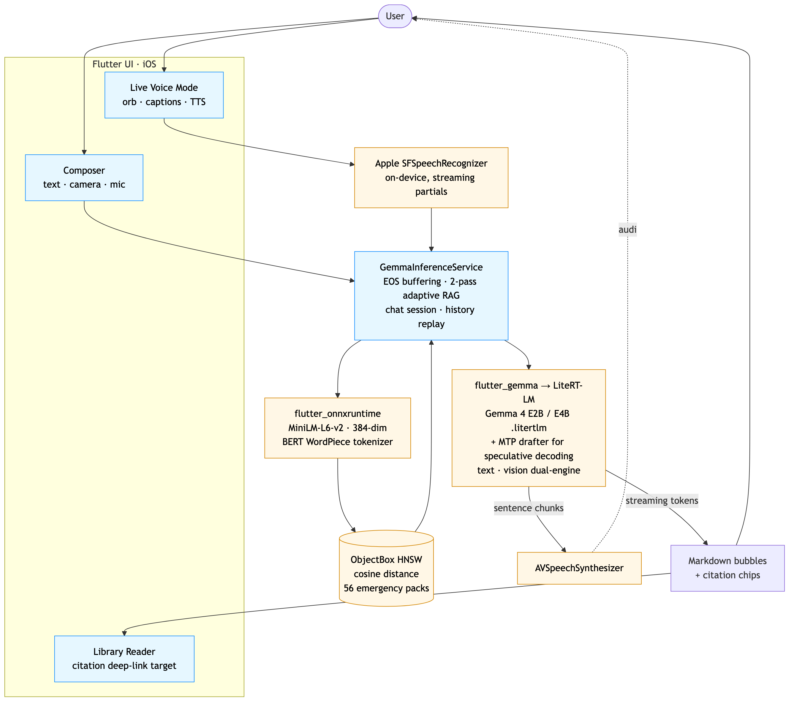
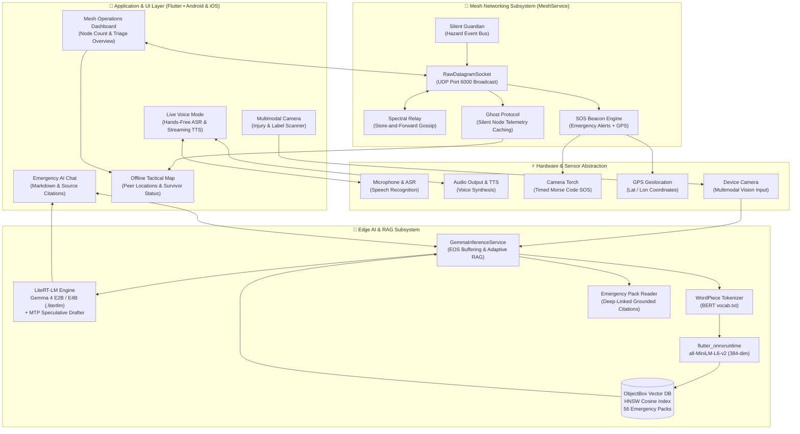

<!-- prettier-ignore -->
<div align="center">

# RescueMesh

**Decentralized Offline Disaster Response Network Powered by On-Device Gemma 4 AI**

[](https://flutter.dev)
[](https://huggingface.co/litert-community)
[](https://ai.google.dev/edge/litert)
[](https://objectbox.io/)
[]()
[](LICENSE)

<br />

[Overview](#overview) • [Key Features](#key-features) • [Application Preview](#application-preview) • [Architecture](#architecture) • [Mesh Protocol](#mesh-network--protocols) • [Emergency Knowledge Base](#emergency-knowledge-base) • [Tech Stack](#tech-stack) • [Getting Started](#getting-started) • [Credits](#credits)

<br />

<table align="center">
  <tr>
    <td align="center" width="25%"><b>Emergency AI Chat</b></td>
    <td align="center" width="25%"><b>P2P Mesh Network</b></td>
    <td align="center" width="25%"><b>56 Knowledge Packs</b></td>
    <td align="center" width="25%"><b>On-Device Models</b></td>
  </tr>
  <tr>
    <td><a href="./docs/screenshots/Screenshot_20260730-222731.png"></a></td>
    <td><a href="./docs/screenshots/Screenshot_20260730-222723.png"></a></td>
    <td><a href="./docs/screenshots/Screenshot_20260730-222736.png"></a></td>
    <td><a href="./docs/screenshots/Screenshot_20260730-222741.png"></a></td>
  </tr>
</table>

</div>

---

## Overview

When major natural disasters, severe grid failures, or extreme emergencies strike, traditional communications infrastructure collapses: cell towers lose power, fiber backhauls sever, and internet access goes dark. In these critical hours, ordinary smartphones become disconnected from emergency services and medical knowledge.

**RescueMesh** transforms consumer smartphones into autonomous, resilient, and interconnected emergency response nodes. By uniting **Google's Gemma 4 on-device multimodal models**, **sub-second embedded vector retrieval (RAG)**, and a **self-healing peer-to-peer ad-hoc mesh network**, RescueMesh provides verified medical guidance, multimodal triage, emergency beaconing, and decentralized field coordination.

> [!TIP]
> **Zero Cloud Dependency**: RescueMesh functions entirely in **Airplane Mode**. It requires no external servers, no cloud APIs, and no SIM card connectivity once installed.

---

## Key Features

### On-Device Gemma 4 AI & Adaptive RAG
- **Quantized Edge Inference**: Executes Gemma 4 (E2B and E4B variants) directly on device hardware via Google AI Edge's **LiteRT-LM** engine with GPU acceleration and speculative decoding.
- **Embedded Vector Search**: Leverages an on-device **MiniLM-L6-v2** embedding model (384-dimensional space via ONNX Runtime) coupled with **ObjectBox HNSW** vector index for instant semantic retrieval.
- **Two-Pass Grounded Synthesis**: Dynamically retrieves matching segments from 56 verified emergency packs, injects verified guidance into the context window, and displays clickable citation badges that deep-link into the full source protocols.

### Ad-Hoc Peer-to-Peer Mesh Network
- **Zero-Infrastructure Discovery**: Communicates over local UDP subnet broadcast and direct Wi-Fi/mesh channels, creating a local decentralized network spanning 100+ meters per node.
- **Ghost Protocol**: Automatically logs and caches peer beacons. If a connected survivor or responder device drops offline or goes silent, its last-known triage status, battery state, and coordinates remain preserved and visible to peers across the mesh.
- **Spectral Relay**: Multi-hop gossip store-and-forward packet propagation ensures critical alerts reach beyond line-of-sight while preventing duplicate broadcasts and memory bloat.

### Multimodal Triage & Live Voice
- **Vision-Enabled Assessment**: Captures and analyzes injury photos, hazardous condition signs, or medication packaging locally through Gemma 4's native multimodal vision encoder.
- **Hands-Free Live Voice Mode**: Integrates on-device Speech-to-Text (ASR) and streaming Text-to-Speech (TTS) with an animated state orb, enabling hands-free operation for responders attending to casualties.

### Tactical Mapping & Emergency Signaling
- **Offline Situational Awareness**: Displays local mesh nodes, their assigned roles (Survivor, First Responder, Medic), and triage levels (Safe, Need Help, Critical) on an offline map.
- **Hardware Optical SOS**: Features a millisecond-accurate optical Morse code flasher using the device's camera LED torch (`... --- ...`) to signal search teams at night or across line-of-sight distances.

---

## Application Preview

| Module | Capability |
|---|---|
| **Emergency AI Assistant** | Grounded question-answering with one-tap situational starters (*Cuts & Bleeding*, *Build Fire in Rain*, *Water Purification*, *Hypothermia Signs*). |
| **Mesh Operations Dashboard** | Real-time active node count, community triage overview (Safe / Need Help / Critical), one-touch SOS beacon broadcast, and Ghost Protocol activity log. |
| **Emergency Knowledge Library** | 56 pre-indexed, searchable offline knowledge packs with step-by-step triage actions, precautions, and equipment checklists. |
| **Model Engine Manager** | Download, configure, and swap on-device model weights locally between Gemma 4 E2B (high-speed balanced) and E4B (deep reasoning). |

---

## Architecture

RescueMesh is built with a modular, layered architecture that isolates hardware communication, local machine learning runtimes, mesh networking, and application state.

<div align="center">
  <a href="./docs/architecture.png">
    
  </a>
  <p><i>System Architecture Diagram — Click image to view full-resolution</i></p>
</div>

### End-to-End System Diagram



### Subsystems Breakdown

1. **User Interface & Interaction**: Built with Flutter, utilizing reactive state management for real-time mesh updates, chat message streaming, audio waveform visualizers, and interactive Markdown citations.
2. **On-Device Inference Pipeline (`GemmaInferenceService`)**: Manages model lifecycle, KV-cache projection, EOS token buffering, prompt formatting, and multi-turn context replay.
3. **Semantic Retrieval Engine**: Employs WordPiece tokenization and MiniLM-L6-v2 ONNX embeddings against an on-device ObjectBox vector database using HNSW cosine distance indexing.
4. **Mesh Networking Engine (`MeshService`)**: Manages UDP broadcast sockets, peer heartbeats, SOS payload serialization, relay pruning, and persistent device identification.
5. **Hardware Abstraction Layer**: Interfaces directly with device camera, audio microphone streams, speech synthesizers, torch flashlight channels, and GPS sensors.

---

## Mesh Network & Protocols

RescueMesh operates completely peer-to-peer without relying on centralized coordination, Wi-Fi routers, or internet access.

```
+-------------------------------------------------------------------------+
|                         RescueMesh P2P Subnet                           |
|                                                                         |
|  [Node A (Medic)] <--- UDP 6000 ---> [Node B (Survivor)]                |
|         |                                   |                           |
|   Spectral Relay                      Spectral Relay                    |
|         v                                   v                           |
|  [Node C (Responder)] <------------> [Node D (Ghost Node)]             |
|                                       (Went silent - last state cached) |
+-------------------------------------------------------------------------+
```

### 1. Ghost Protocol
In emergency zones, devices frequently power down, run out of battery, or move out of radio range. When a node stops broadcasting its 2-second heartbeat, RescueMesh does not simply drop it. Instead, **Ghost Protocol**:
- Moves the device from the active device list into the persistent ghost registry.
- Retains its last known triage status (`Safe`, `Need Help`, `Critical`), assigned role, timestamp, and GPS position.
- Shares the ghost record across mesh peers so search and rescue teams know who went missing, where they were last located, and their emergency status.

### 2. Spectral Relay (Gossip Protocol)
- **Store-and-Forward**: Every participating node acts as a gossip relay. Incoming messages and SOS alerts are cached in `_relayStore` and periodically propagated to new peers on the subnet.
- **Deduplication**: Uses a FIFO-capped `_seen` packet digest to prevent broadcast storms and duplicate message delivery across multi-hop hops.

### 3. SOS Beaconing & Hardware Signaling
- **GPS-Tagged SOS**: Tapping **Send SOS Beacon** transmits high-priority broadcast packets embedding the node's unique ID, user name, and last-known GPS coordinates (`getLastKnownPosition`).
- **Morse Code Optical Strobe**: Chained, millisecond-accurate software timers strobe the phone's camera LED flash in the universal distress pattern `... --- ...` (3 short flashes, 3 long flashes, 3 short flashes).

---

## Emergency Knowledge Base

RescueMesh bundles **56 curated emergency knowledge packs** pre-processed into propositional chunks and indexed for immediate RAG retrieval. Sourced from public safety protocols published by the **American Red Cross**, **CDC**, **NOLS Wilderness Medicine**, and **DOT Emergency Response Guides**:

```
assets/rag/packs/
├── Trauma & First Aid         # Bleeding, CPR, Burns, Choking, Shock, Head & Eye Injuries, Gunshot Wounds
├── Natural Disasters          # Earthquakes, Floods, Wildfires, Hurricanes, Tornadoes, Tsunamis, Avalanches
├── Environmental Survival     # Extreme Cold, Extreme Heat, Water Purification, Food Poisoning, Power Outage
├── CBRN & Industrial Hazards  # Hazardous Materials Release, Gas Leaks, Radiation/Nuclear Hazards, Pipeline Leaks
└── Community Crisis           # Building Collapse, Civil Unrest, Crowd Crushes, Search & Rescue Procedures
```

---

## Tech Stack

| Layer | Component | Implementation |
|---|---|---|
| **Application UI** | Flutter 3.6+ / Dart | Cross-platform Material 3 responsive interface |
| **On-Device LLM** | Gemma 4 (E2B / E4B) | LiteRT-LM (Google AI Edge) runtime with GPU acceleration |
| **Vector Database** | ObjectBox 5.3+ | Embedded on-device HNSW vector index (cosine distance) |
| **Embedding Model** | all-MiniLM-L6-v2 | 384-dimensional ONNX runtime with custom BERT tokenizer |
| **P2P Mesh** | UDP Broadcast & Gossip | Ad-hoc subnet discovery, persistent device ID, Ghost Protocol |
| **Voice & Speech** | Native ASR & TTS | Cross-platform speech-to-text and streaming speech synthesis |
| **Offline Mapping** | flutter_map & latlong2 | Offline-cached OpenStreetMap tile rendering & peer markers |
| **Hardware Control** | Camera, GPS & Flashlight | Low-level method channels for camera vision & timed Morse strobe |

---

## Getting Started

### Prerequisites

- **Flutter SDK**: `>= 3.6.0` ([Install Flutter](https://docs.flutter.dev/get-started/install))
- **Android**: Android Studio with SDK API 26+ (Android 8.0 or newer)
- **iOS**: macOS with Xcode 15+ and CocoaPods (iOS 17+ recommended for on-device Gemma inference)
- **Hardware**: Modern device with at least 4 GB RAM (6 GB+ recommended for Gemma 4 E2B/E4B inference)

### Installation

1. **Clone the repository:**
   ```bash
   git clone https://github.com/piyushdotcomm/RescueMesh.git
   cd RescueMesh
   ```

2. **Install Flutter dependencies:**
   ```bash
   flutter pub get
   ```

3. **Verify code analysis:**
   ```bash
   flutter analyze
   ```

4. **Run on a connected device:**
   ```bash
   flutter run --release
   ```

> [!IMPORTANT]
> **Release Mode Required:** Always run the application with `--release`. Debug mode disables compiler optimizations and LiteRT-LM GPU delegate acceleration, making on-device model inference too slow for interactive conversation and speech streaming.

### First-Time Model Setup

On the first launch of RescueMesh:
1. Ensure your device is connected to Wi-Fi to download the quantized Gemma model weights.
2. Navigate to the **Models** tab.
3. Select **Gemma 4 E2B** (~1.4 GB, recommended for standard devices) or **Gemma 4 E4B** (~3.7 GB, recommended for high-RAM devices).
4. Once the download completes, you can turn off Wi-Fi, enable **Airplane Mode**, and operate entirely offline.

---

## Credits

- **Gemma 4** — Google DeepMind
- **LiteRT-LM** — Google AI Edge team
- **flutter_gemma** — Community Flutter wrapper for LiteRT-LM
- **ObjectBox** — Embedded vector database with on-device HNSW indexing
- **Sentence-Transformers** — `all-MiniLM-L6-v2` lightweight embedding model
- **Emergency Protocols & Data** — American Red Cross, CDC, NOLS Wilderness Medicine, and US DOT Emergency Response Guides

---

## Attribution

This project utilizes Google's Gemma 4 models for on-device inference.  
**Gemma is a trademark of Google LLC.** Gemma 4 is distributed subject to the [Gemma Terms of Use](https://ai.google.dev/gemma/terms).

---

## License

This project is licensed under the [Apache License 2.0](LICENSE).
