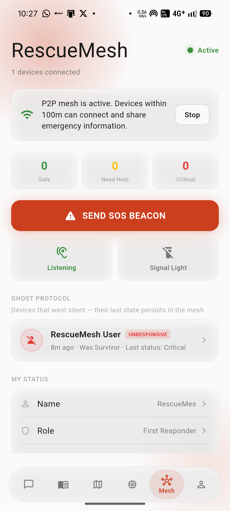
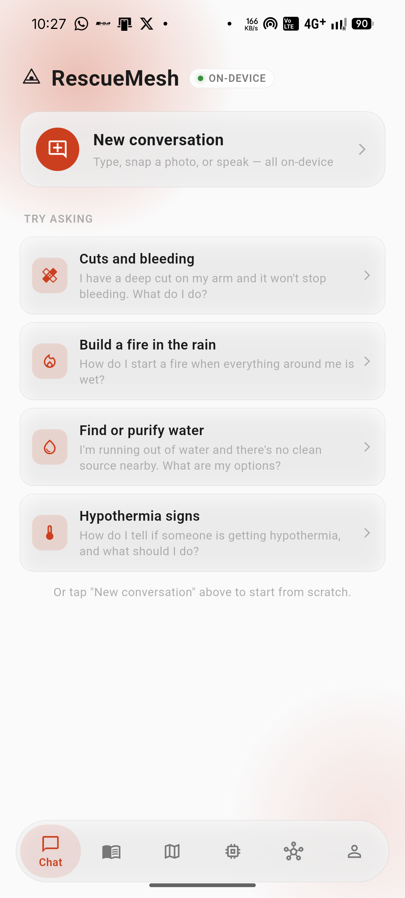
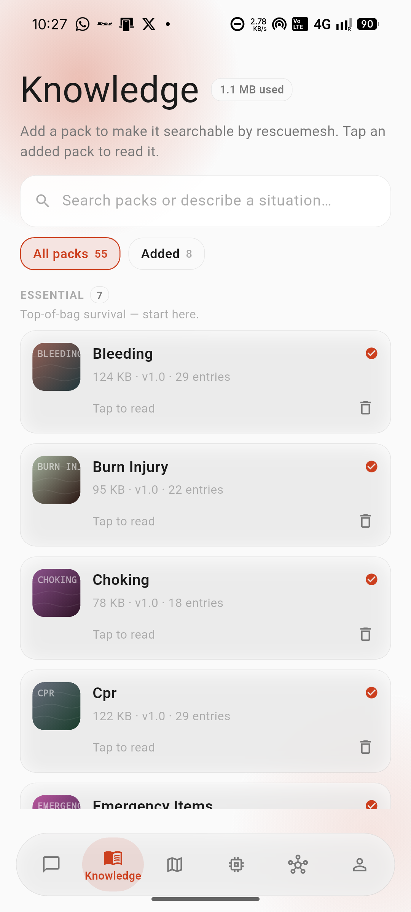
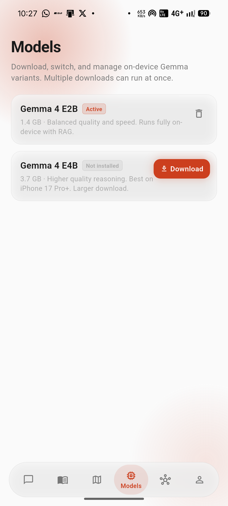

# RescueMesh

- *Track:* AI off the Grid
- *Team:* Team Backlog

---

## Problem

When disaster strikes, three things fail simultaneously: cell towers go down, power grids collapse, and communication becomes impossible. People are isolated with no way to call for help. Emergency services work blind, unable to coordinate or locate survivors. Smartphones — the one device almost everyone carries — become useless bricks at the exact moment they're needed most.

---

## Solution

RescueMesh turns every smartphone into an offline AI survival node. Users get an emergency AI assistant powered by Gemma 4 running entirely on-device — no internet required, no API keys, no data leaving the phone. They can ask medical questions by text, voice, or camera (wound assessment, medication label scanning) and get cited answers from 56 pre-loaded emergency knowledge packs covering everything from CPR to nuclear fallout. Simultaneously, phones form a self-healing WiFi Direct mesh network that lets survivors broadcast SOS beacons with GPS location, share status updates, assign roles, and coordinate resources — all without a single cell tower standing. It's a lifeline for the first 72 hours after a disaster.

---

## How Gemma Is Used

- **Model variant:** Gemma 4 E2B-it (2B-effective params; default) and Gemma 4 E4B-it (4B-effective params for devices with 6+ GB free RAM)
- **How it's used:** Base model with a carefully designed multi-variant system prompt (RAG-aware, live voice, vision, and general modes) + on-device RAG pipeline. No fine-tuning — the base model's instruction-following is strong enough with the right system prompt engineering.
- **Why Gemma 4:** The LiteRT-LM format (.litertlm) is purpose-built for mobile GPU inference via Google AI Edge. Gemma 4 E2B at ~1.4 GB runs well on consumer smartphones with Metal/GPU acceleration, while E4B at ~3.7 GB offers higher reasoning quality when hardware allows. The open license (Gemma Terms of Use) and multimodal support (text + vision) made it the clear choice — no other model gave us on-device vision understanding at this quality level.
- **Customization:** The system prompt has four variants selected at runtime based on input mode — (1) RAG-aware mode with inline citation directive, (2) live voice mode optimized for TTS playback (no markdown, 1-3 sentences), (3) vision mode focused on image understanding without citation noise, and (4) a combined voice+vision variant. An adaptive two-pass RAG retrieval pipeline uses Gemma itself as a query rewriter when the first retrieval pass is weak, converting terse user queries ("i got shot") into search-ready questions ("How do I treat a gunshot wound?") before a second retrieval pass.

---

## Architecture

```
┌──────────────────────────────────────────────────────────┐
│                      RescueMesh App                       │
│  ┌─────────┐  ┌──────────┐  ┌──────────┐  ┌──────────┐  │
│  │  Chat   │  │  Voice   │  │  Camera  │  │   Mesh   │  │
│  │ Screen  │  │  Screen  │  │  Screen  │  │  Screen  │  │
│  └────┬────┘  └────┬─────┘  └────┬─────┘  └────┬─────┘  │
│       │            │             │              │         │
│  ┌────┴────────────┴─────────────┴──────────────┴────┐   │
│  │              Inference Service                      │   │
│  │  ┌──────────────┐  ┌────────────┐  ┌───────────┐  │   │
│  │  │ Gemma 4 E2B  │  │  MiniLM     │  │  ObjectBox │  │   │
│  │  │  (LiteRT-LM) │  │ (ONNX Emb)  │  │  (HNSW RAG)│  │   │
│  │  └──────────────┘  └────────────┘  └───────────┘  │   │
│  └────────────────────────────────────────────────────┘   │
│  ┌────────────────────────────────────────────────────┐   │
│  │              Mesh Service                           │   │
│  │  WiFi Direct P2P  │  SOS Beacons  │  GPS Sharing   │   │
│  └────────────────────────────────────────────────────┘   │
│  ┌────────────────────────────────────────────────────┐   │
│  │              Voice Service                          │   │
│  │  On-device ASR (speech_to_text) │ TTS (flutter_tts) │   │
│  └────────────────────────────────────────────────────┘   │
└──────────────────────────────────────────────────────────┘
```

**Data Flow (RAG query):**
1. User types "how do I treat a burn" → MiniLM embeds the query (384-dim, ONNX Runtime)
2. ObjectBox HNSW retrieves top-5 matching chunks from installed emergency packs
3. If top score > 0.5 cosine distance: Gemma rewrites query → re-embeds → re-retrieves
4. Retrieved chunks are threshold-filtered (≤0.65), sorted, and packed into a context block with `[1]`, `[2]` labels
5. Context block + user message + system prompt → Gemma 4 generates a cited response
6. Response streams token-by-token to the UI with real-time citation chip rendering

**Data Flow (Mesh):**
1. User activates mesh → device broadcasts identity + GPS + status via WiFi Direct UDP on port 6000
2. Neighboring devices pick up broadcasts → display on real-time offline map (flutter_map + latlong2)
3. SOS beacons propagate peer-to-peer with GPS coordinates
4. Ghost protocol: devices that go silent are tracked for 30 minutes with last-known position

**Tech stack:** Flutter (Dart), Gemma 4 via LiteRT-LM (Google AI Edge), MiniLM via ONNX Runtime, ObjectBox HNSW vector database, WiFi Direct P2P networking, on-device ASR (speech_to_text) + TTS (flutter_tts), flutter_map + OpenStreetMap tiles

**Model download:** Gemma 4 models (~1.4 GB E2B, ~3.7 GB E4B) are downloaded on-device from HuggingFace at first launch — they are NOT bundled in the APK. Users pick their model variant based on device capability and disk space. The download has a live progress bar with EMA-based ETA estimation, cancel support, and graceful retry on failure.

---

## Results / Demo

- **Offline-first:** The entire stack runs without internet. Chat, RAG retrieval, voice, and mesh networking all function in airplane mode. Tested and verified on Android.
- **56 emergency packs** covering CPR, wound care, burns, fractures, snake bites, hypothermia, earthquake response, active shooter, flood, nuclear fallout, and more — drawn from American Red Cross, CDC, NOLS Wilderness Medicine, and DOT Emergency Response Guidebook.
- **RAG retrieval quality:** Two-pass adaptive retrieval (raw query → MiniLM HNSW → weak? → Gemma rewrite → re-retrieve) significantly improves hit rate on terse conversational queries vs single-pass retrieval alone.
- **Citation accuracy:** Retrieved chunks carry source labels inline and as UI chips so users can verify every claim against the original emergency guide.
- **Mesh resilience:** Peer-to-peer UDP discovery with ghost protocol handles devices joining, leaving, and going silent naturally — no central coordinator required.

*Demo video:* [https://youtu.be/YLkkAjyB9fM?si=DAmRislA9tfAvoWD](https://youtu.be/YLkkAjyB9fM?si=DAmRislA9tfAvoWD)

*Screenshots:*

| | | | |
|---|---|---|---|
|  |  |  |  |
| **Mesh Dashboard** — P2P network with SOS beacon, device status, and Ghost Protocol | **Chat** — AI assistant with suggested survival topics | **Knowledge Library** — 56 downloadable emergency packs | **Models** — On-device Gemma 4 E2B/E4B management |

---

## Links

- **GitHub repo:** [https://github.com/piyushdotcomm/RescueMesh](https://github.com/piyushdotcomm/RescueMesh)
- **Datasets used:** American Red Cross First Aid/CPR/AED participant guides, CDC Emergency Preparedness and Response resources, NOLS Wilderness Medicine protocols, DOT Emergency Response Guidebook (all public domain / freely available for educational use)
- **License for this project:** Apache License 2.0 — see [LICENSE](LICENSE)

---

## Acknowledgments

Gemma 4 models and LiteRT-LM runtime by **Google DeepMind** and **Google AI Edge**. Gemma is a trademark of Google LLC. The embedding model is MiniLM (Microsoft, ONNX-exported). RAG vector search powered by **ObjectBox**. Emergency knowledge content derived from publicly available guides by the **American Red Cross**, **CDC**, **NOLS**, and **U.S. Department of Transportation**. Built for the **BUILD WITH GEMMA AI Buildathon 2026**.
